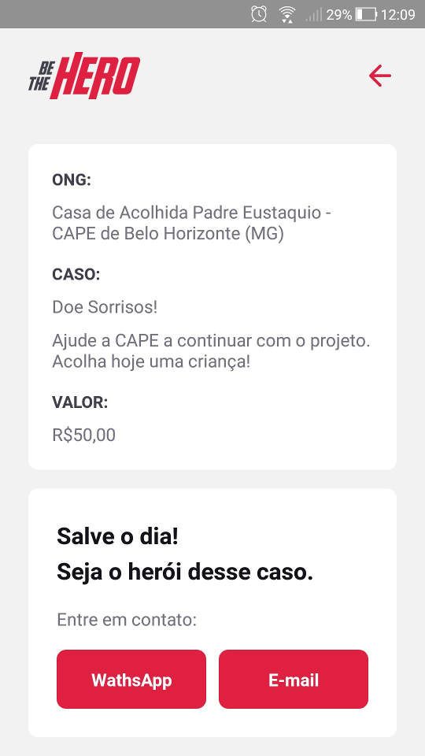

# Be The Hero

Be the hero é uma aplicação para conectar pessoas que tem vontade de ajudar ONGs.  

Interface WEB  

Interface Mobile  

Projeto resultante da Semana OmniStack 11.0 - [Rocketseat](https://rocketseat.com.br/)

## O Projeto

Be the hero é uma aplicação para conectar pessoas que tem vontade de ajudar ONGs.  
As ONGs se cadastram via aplicação web.  
Elas cadastram os casos informando um título, a descrição e o valor desejado.  
Através de um aplicativo mobile as pessoas conseguem visualizar os casos e podem entrar em contato através de email ou WhatsApp.  

### Entidades
* ONG
* Caso (incident)

### Funcionalidades
Web
* Login de ONGs
* Logout de ONGs
* Cadastro de ONG
* Cadastro de novos casos
* Lista de casos específicos de uma ONG
* Exclusão de casos

Mobile
* Lista de todos os casos
* Entre em contato com a ONG
